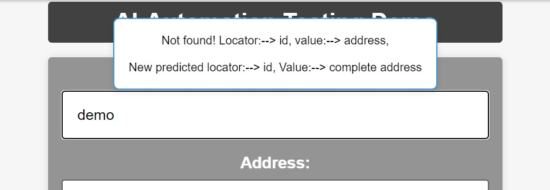

# AI Driven Automation Testing

This repository contains a Python script for a self-healing automation system using AI-driven testing. The script utilizes Selenium for web automation, BeautifulSoup for HTML parsing, and similarity matrix. The self-healing aspect is achieved through the prediction of updated locators based on the current webpage structure.

Installation 
Before running the script, ensure you have the necessary dependencies installed. You can install them using the following commands:

pip install beautifulsoup4 
pip install chromedriver-autoinstaller 
pip install flask 
pip install selenium

Clone the Repository: 
git clone <a href="https://github.com/Nitish1206/AI-driven-Selenium.git">https://github.com/Nitish1206/AI-driven-Selenium.git</a>

cd webapp 
Run the Script: 
Execute the flask_app.py script 
python flask_app.py

cd automation_script 
Run the Script: 
Execute the ai_driven_testing.py script 
python ai_driven_testing.py

This will initiate the self-healing automation process on a local Flask web application. The script will automatically interact with the webpage, updating form fields and predicting new locators if needed.

Configuration 
Web Application URL: 
The script is set to interact with a local Flask web application. Update the url variable in the script if your application is hosted elsewhere.

Default User Data: 
The script is initialized with default user data for form fields. You can customize the user details in the SelfHealingAutomation class constructor.

Folder Structure 
data/: Contains the training data CSV file. 
ai_driven_testing.py: The main Python script for self-healing automation.

Acknowledgments 
Inspired by the concept of self-healing automation in software testing. 
Libraries used: Flask, Selenium, BeautifulSoup, scikit-learn. 
Feel free to explore and modify the script to suit your specific testing needs. If you encounter any issues or have suggestions for improvements, please open an issue or submit a pull request. Happy testing!
